## 2021 06 19

About the z axis here, I am tempted to go with a printed approach - then we can have the same reduced BOM for fab labs etc, actually seems like it's going to matter.

And I can sneak bearings around places, rather than some humunculus linear rail. It's hard to say though, only real evaluation would be to design both and see how they shake out.

As far as stiffening things up, then, I basically want to wrap these little 45-degree ears around to connect w/ the hardpoints for the static XY rollers - those mount _thru_ the faceplate and are probably the most skookum mount-up. Them being symmetric as well means I can design one part and mirror that for some nice complexity saving - though I might want to pin the upper bands a bit higher.

The preload is a question then. I could put a big flexure in the rail itself, if that's going to be printed, but I might rather do it again at the bearing mount.

I guess the question is about where to send the space though - I could also (not the ears) sabotage the width to push the idlers back into the x carriage, splitting that wide.

There is a wicked simple approach where I kind of abandon full constraint and just use 4 rollers thru the same axles that constrain the YZ plane on the x carriage. This is probably the most mechanically concise, simple, but requires awkward loading in XY and likely some small rocking on the corners of the bearings - not exactly welcome unless they were properly double row bearings. I also have to preload one side, which doesn't exactly vibe with the x carriage axle mounts.

This is for sure the thinnest / simplest / stiffest design, though I can't say that I love the rollers there. Maybe I could ameliorate my worry with a set of 624 bearings, loaded together to become a dual row angular.

For sure that could help somewhat, but I am also going to have the bearing-corner-on-printed-part rolling contact. I could print a wheel around the thing, which I kind of need to do anyways to make sure the seating produces some proper race-to-roller preload, but then I have a likely non-concentric printed bit guiding motion. It's common at this scale of machine, but liable to produce accuracy errors on order of 0.1mm, though they might wear in with time and the preload will ensure they're not backlash errors.

I wonder what's worse, the little non-concentricity errors, or the bearing-on-plastic wear. Probably the latter, I can imagine shock loads punching divets in the plastic guide. Plastic on plastic (normal-to-normal) loads would undo this.

... This one's a pickle for sure.

There is a useful design pattern from the old Ratchet, which is a similar energy to what I'm trying to do here;

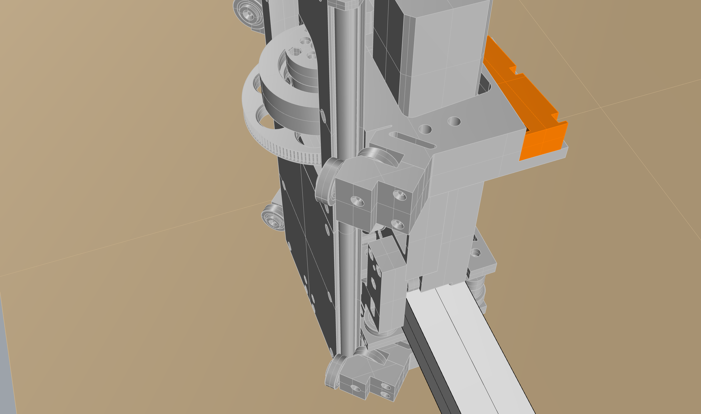

Here I gave up on trying to keep the z drop tight and just whacked this 45' bearing mount below. Riding on some small shafts.

This is perhaps not as heroic as I am thinking it would be. I could do it with two variants; one w/ tapped linear shafts as contacts, the other with printed ways.

So this is like;

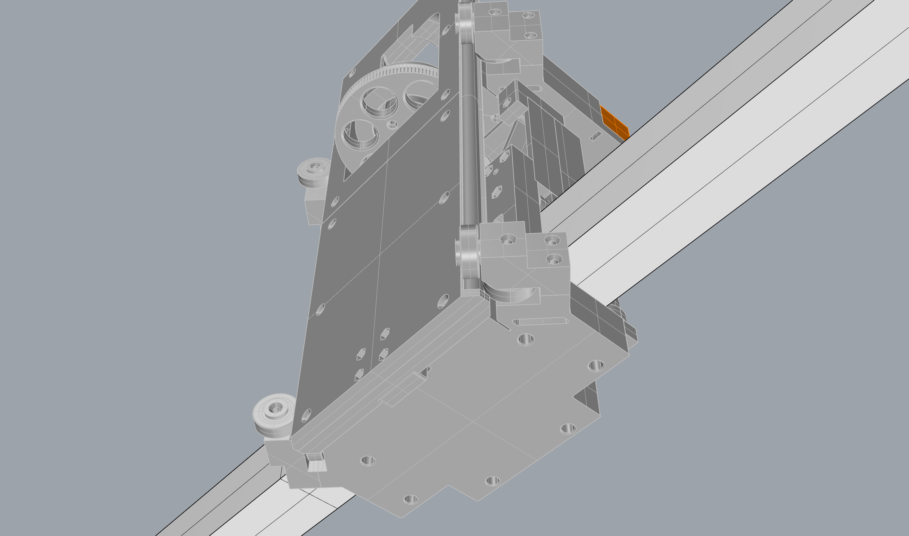
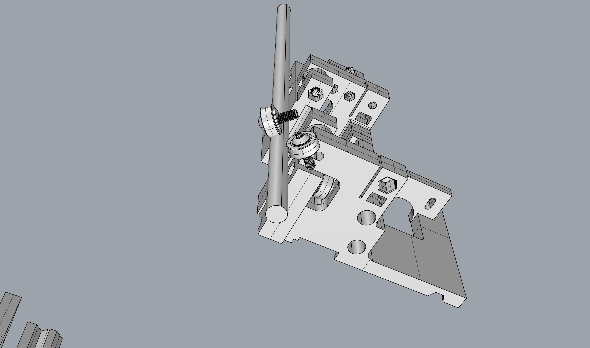

Same energy, maybe pinch up the bottom.

Ah, what about:

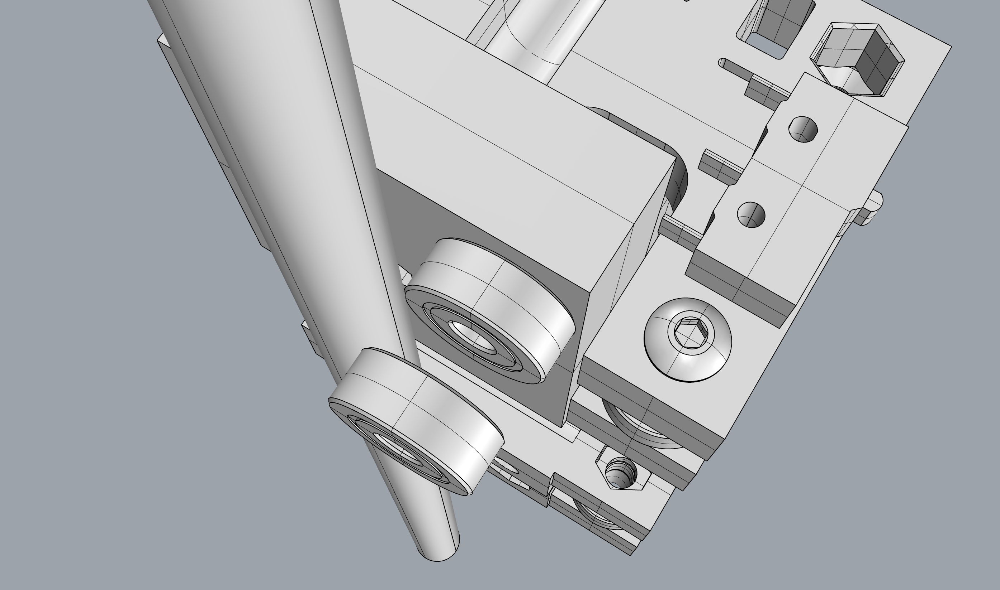

Steel:Steel bearing faces, not ideal but way stiffer than any plastic contacts. Some strange bearing race loading for sure. But probably buttery. I could also do something like:

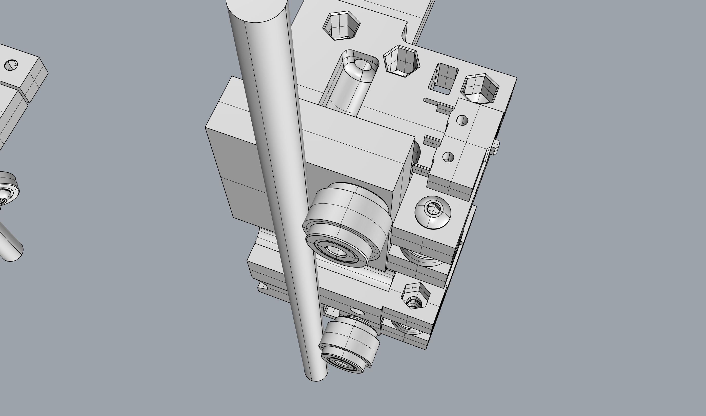

Where I print that little bearing cup to match the rail's profile (or printed part's faces). With both of those I could set the rail up on the exterior of the rollers to bring the width up.

Oddly I think actually the first instict is correct here, 45' rollers with some slightly awkward design finangling to get stiff-ish structures, but I can use width of X carriage to compensate, I figure the internal width is key here esp. if we want to bring the tool closer in to everything: I figure this will make the most difference. There's also more chance there of the eventual one-x-carriage-for-them-all setup... which would be rad if we move to the injection moulded parts that would greatly improve all up stiffness / performance.

So a lot to think about still, but I would venture first with the 45' rollers, I think it just requires a little bit of witching on the x carriage / knuckle design, but isn't heroic and leaves room for i.e. drive components down the center. Surely I could be wrong and the horizontal rollers also have some appeal,

Ah shit - this might be it;

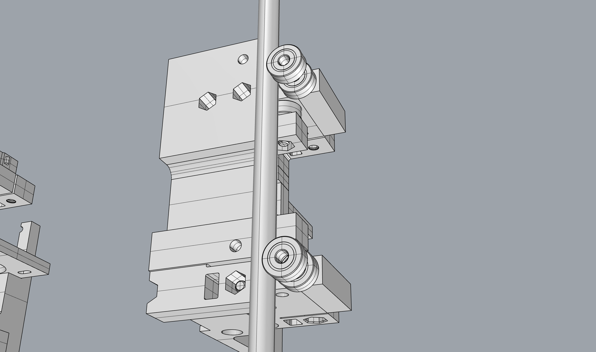

Super stiff mount to top / bottom x plates, can launch a deep M4 axle through there. Printed rollers on preloaded sets of 624, will eat whatever misalignment and can test also straight bearing-on-shaft contact. Lots of space on those ears to doodle in some flexures if I think it's necessary, something like this rotary-with-beam-spring:

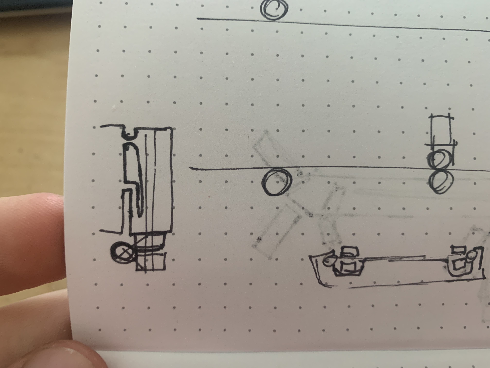

OK this is my favourite now, dead simple, can become stiff, looses width but wins in low-profile (Y dir). I think I'll try that first, and will use straight bearing-on-rail contact: if that works well, it'll be smooth AF.

Lots of commotion around the bush here, feeling schitzophrenic. All of the same benefits above can be had in the more bearing-friendly 45' rollers, I'm going to try that on first.

## 2021 06 20

Roller deeesign today, back in fusion.

Also want to see about skinny-efying the toolchanger: maybe loading the servo above, using some leverage-rotating cam to pinch things around.

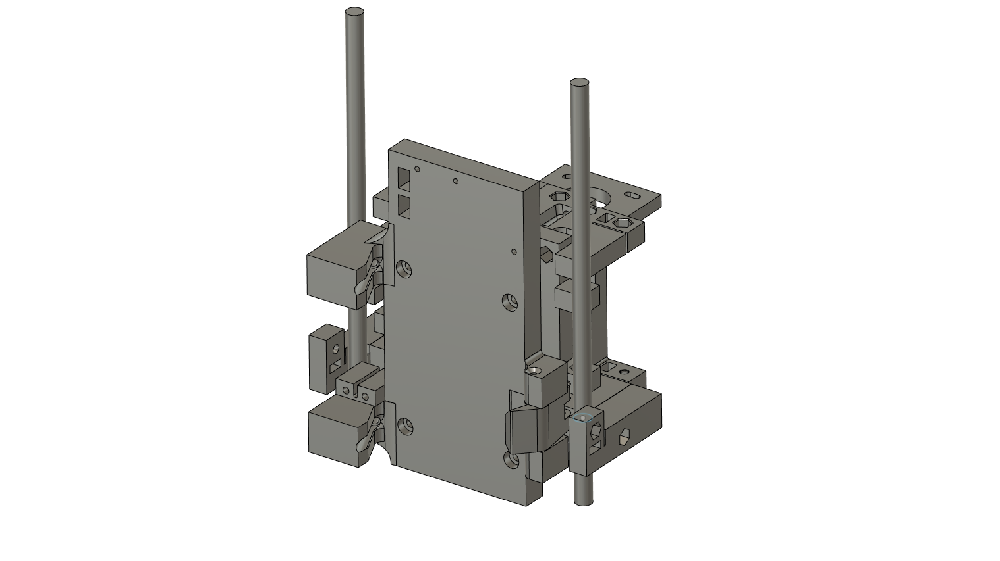

Well there's a pretty wide z axis, just have the bottom corners detailed and no X constraint there yet, thing is 140mm wide in total, but brings the tool plate right up against the x carriage. It feels too wide, not tall enough - like a racking door. I wonder if bringing the x rail to 80mm tall is worth it. I also wonder if this is evidence in support of the bearing abuser design... I'll give that a revision.

I think just purely on simplicity this might win, took 8 minutes to model in. So I think I'll flip that, add a flex / adjust point on one side, and get on with the actual z and drive. Detail check for fastener lengths etc...

All of this complication, I would say that it's likely a little linear rail in here would solve the problem with a series of bolt holes. I wonder if it would be any stiffer, or less, as the load path through those bolt holes would be travelling through some bendy plastic bits.

Well, still flummoxed about this. Tiny, low profile z axis remain the bain of otherwise chunky 3D Printed machines. No clear resolution here, will continue to try it out later.

Mostly, the struggle now is in the toolchanger, which is no so svelte. It wants to be tall and skinny and low profile, but has this relative chonk of a lever behind, and is embiggened by the servo to the left. Don't get me wrong, I like that thing, but it's just not singing to me at the moment.

## 2021 06 21

OK, hadn't intended to spend these days on the z axis but here we are. I think the rollers I have setup here are the best case ontario, and I can adjust the pinch plate design in the future if I want to pinch the thing rearwards / towards the rail. Time being, I'll just lock this design down, fabricate & test one. I need the z-drive as well of course.

Here's the result of this setup;

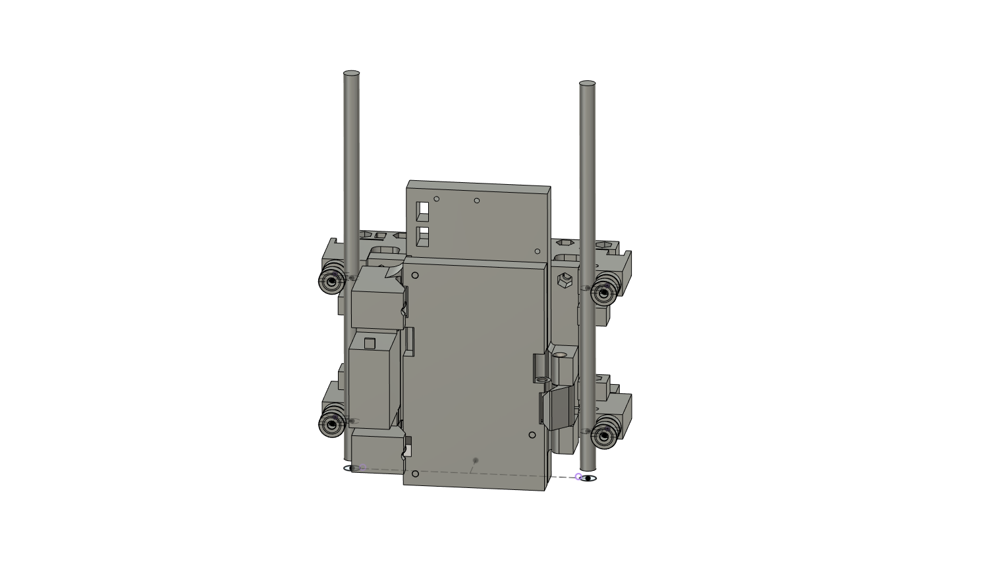

126mm x distance, 74mm z distance, about 1:2 spread where we want closer to 1:1 or in the best case 3:1, so a pretty bad spread. It's wider than it should be - this is `Saint-Venant's Principle` here, though I feel good about the rollers since their friction is so low I am less likely to see jamming, I still don't like it.

One answer is to push the rails into the rear of the pinch plate, lining up bearing overlap and saving some X width but loosing ~ 15mm in distance-from-rail in Y.

I could lift the top rollers _up_ but then I'm staring in the face of a very tall / flexy plastic bit on the top plate, I don't like that too much.

42.3 vs 31.4 rail-to-rear-hotplate-face... w/ 40mm width saving.

Yeesh, I hate this. If I can finangle some flatness on the toolchanger I can push the sticks behind that and stick rollers on the X front faceplate. There I can hit ~ 0 increase in width with ~ 40mm front-of-plate to rail.

I could also ignore the problem entirely if I only want ~ 25mm of z throw, which, to be real, is what I want here. Knife cutters, sheet milling. I get more throw _up_ than down, but that's actually what we typically want for longer endmills etc.

OK so let's model that notion and check it out...

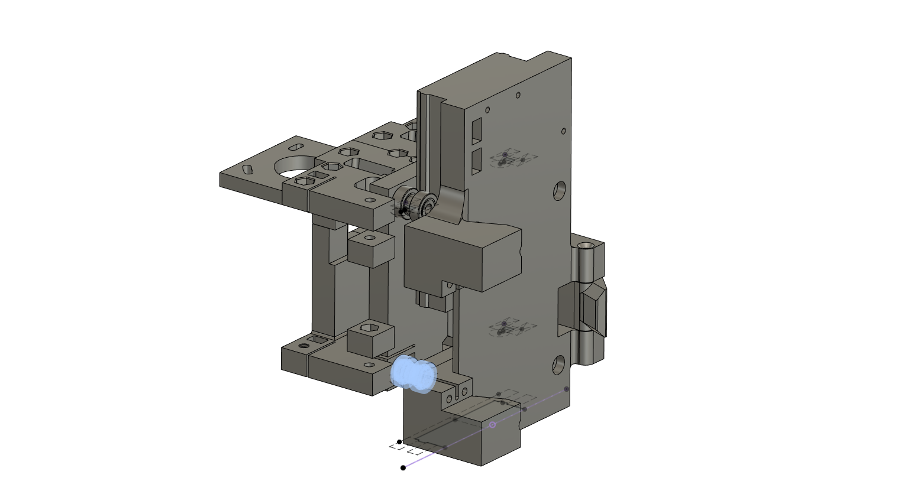

I basically just sneak the clamping pushrod in amongst the bearings, then that defines the down-stop height. I had thought I would get bonus throw 'up' but that's not true, as the lower rollers would roll off in that case. Here I see only ~ 6mm of throw-up and I can probably just about maximize to 25mm of throw-down. That's satisfactory for me, though I know many milling cutters are going to do poorly with this, it'd be nice to have more upswing. Right now there's 40mm of rail-to-face separation in this model, but I can probably delete another 5mm from that.

This is the trick with generalization, it doesn't work everywhere. For knife tools and pen tools and cam'ras this is awesome, for milling it's... close.

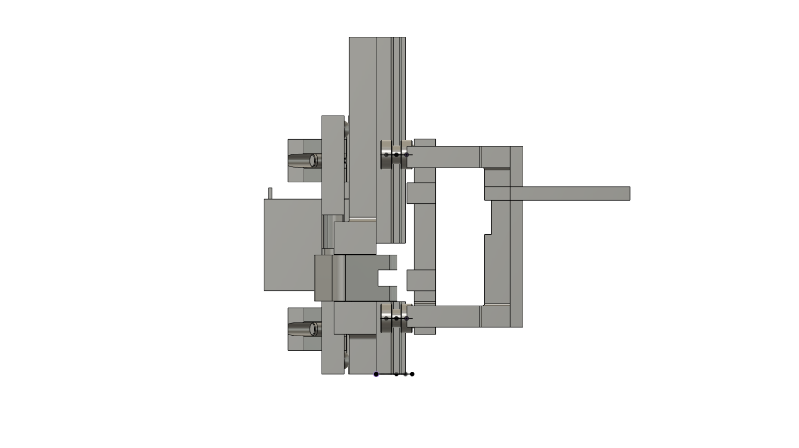

Well - closer. I think I might settle on this, maybe there's simply a modified spindle that handles that offset trouble, otherwise I think it's about the best outcome I can get. Thing's not going to be terribly stiff no matter which way I slice it.

Great - this is at least a direction forwards, and one I feel solid about. It's the tiny-throw, small-offset drive I was thinking about.

## 2021 06 22

Alright, back at this - will start with more detailed design on the rear of the plate.

I'm also lifting the clamping-claw (word?) up by 10mm, this way it's still biased to the bottom but not by as much, and it'll increase my z throw by about 10mm as well.

I think the guide / roller detail is done; need to move on to some cam / z drive.

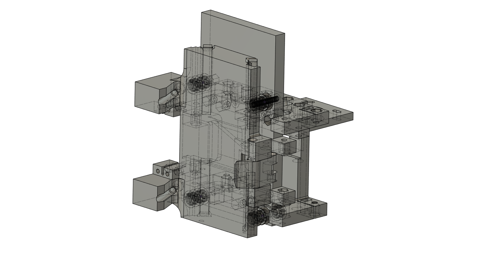

For the drive ... I have 6mm up / 30mm down for a total of 36mm, meaning I need a radial cam at least this large in diameter, ideally larger so that we don't spend much time at the limits. So to pick a bearing / drive, I can start with some existing belt reductions... I am likely to pick a 200mm closed belt length and need a bearing around 6810, which has `50mm ID / 65mm OD / 7mm T`

Can't tell if this is slog work or if I'm burnt out.

## 2021 06 23

Besides detailing this cam drive, I was also thinking it might be wise to bring the x rail up to a 40x60 extrusion for some bonus torsional stiffness. This would bring weight up ~ 2x on Y, pretty big - it's already a lot to haul around with two little NEMA 17s, and would up the weight on the X carriage a little bit as well. I think plastic is still dominating the bending even with this huge length of extrusion to twist, so maybe I'll forget about that. A 20x40 on the Y rails would also be kind of logical, and I might do that when I squanch the frame out - the 20x40 would also give me somewhere to 'grip' the rails along their length.

Ah - they way I was planning on setting the z drive up I'll interfere with a Y motor;

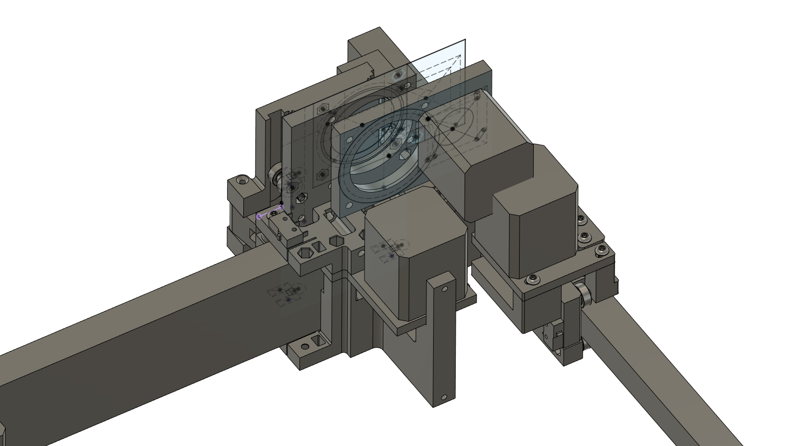

So I need to swap that around, face it forwards, or I could move it up to be in-line vertical, but I don't like the tall stack I get there, throwing a lot of weight around off-axis when I move the y rail back and forth.

This is another dance. I could bring the belt up to 280mm and win some length, or walk the bearing up-and-around the upper left z roller, increasing some height, maybe 10mm.

OK this is coming along OK, I'm going to swap for a larger bearing though and send the cam straight through the stack.

I have a pushrod now, and fusion joint assemblies actually does OK to model the cam-action.

I almost end up in a situation where pushrod-to-z action acts as an endstop, but it's not exactly aligned top / bottom (two DOF) and I only have one adjustment (hits on one side, one DOF adjust) so I should have a proper set of endstops.

OK, those are setup. Some details left, and I think this is working?

Last thing is, I want some kind of brace here to prevent the flippy-floppy top section from being a diving board on z loading.

So for this brace... ??? This little stub is the best I can do:

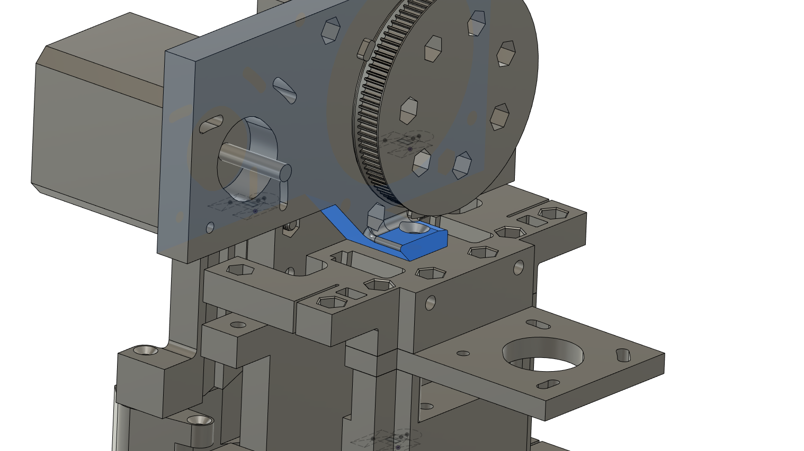

I'll check that out in the first build, do better if it seems necessary.

So now it's just limit switches, then this assembly is done and I'll move on to pogo pinning and cable routing.

## 2021 06 24

OK so - yeah pretty much just the limit switch, on x for sure and if I want one on the rotary, probably should do.

Alright - limits. The hardware on these is a PITA, little baby M2s. Holes on the limits are 2.3mm. I could maybe design a clip that makes this simpler, or use those plastic thread-forming screws - but the right diameter screw is not available in a suitable length. So I'm maybe stuck with these little things. I think I'll just punch tiny holes & see about thread forming with the M2s rather than bothering with the hex inserts.

For the z limit, I can finangle it if I rotate the endstops around the clear the pulley.

OK z limit is done, x limit still.

Done then, and I think this assembly is finished. It's a bit beefy.

## 2021 10 28

Trying to publish this now, going to use it as a reference machine for HTMAA. The unfinished CAD work is:

- YL / YR from -FXY should swap in (?)
- needs belt-ends
- and a base plate / chassis
- needs a cable routing situation
- needs re-integration of the hotplate
- needs a BOM, and a z-axis test (!)

Because these projects are so tied up, I think I might put the clank-stretch stuff back into the -fxy fusion CAD folder. So in some order:

- export -> import the BZZ, less the pinch-plate-z
- work the clank-fxy folder rotary hotplate device w/ end-stub of z-guides
- build -stretch assembly w/ OG YL / YR, BZZ & hotplate
- build out chassis / belt-ends...

That's enough that I'm going to save it for later!

## 2021 10 30

Going through this CAD stuff now... thinking I would like for the setup w/r/t the chassis to be the bolt-it-onto-the-sheet type a-la ratchet... where maybe this scale it is an appropriate response. Should setup the spec then to build relative stock "bed" dimensions and line the tool center up w/ the edges of that stock.

Looking at the z guide / drive, I am wondering if the v-slot wheels are a wise choice. I suspect that steel rail on steel bearing edge is better, but the v-wheels are maybe thinner. We do have these: https://www.vxb.com/624VV-V-Groove-Guide-Miniature-V-Bearing-p/624vv.htm available, I think probably that's the best move.

So I'll build that out w/ a printed interposer for the pinch plate.

These are even _too_ skinny - looks like I will be going to a very small ~ 1/8" steel contact / shim...

Damn this is a real trick. I think there's an opportunity to shift the rollers _out_ a tad, embiggening the interposer... today is free time anyways so I can muck about with it, and this will be the major cinch w/r/t how stiff the z is on this machine.

Think I'm going to sneak them in such that they're loaded right _thru_ to the XY constraint rollers on the X rail. I'll just have to find...

Have this setup, gets ~21mm up and ~14mm down for a 35mm stroke: that's the same as it was before, and not bad... It would be tricky to do any better.

I think this is perhaps more simple than I was anticipating? I can just bolt the z conrod right thru to a mount hole in the hotplate.

## 2021 10 31

There turns out to be some work to do to make clearances when we (will) want to remove the hotplate: the z guide needs to come out and it needs to come _up_ not _down_ ... so there is a channel I've cut in the back of the guide that lets the little z-drive nubbin pass through. And slots in the conrod such that it can swing out of the way. This was ~ 20 minutes in CAD that will surely save me some count of hours in the future assembling / dissassembling.

I have also gained another ~ 10mm in 'down' travel, nice. Photo below shows this path (in hidden lines, check left side of the guide plate).

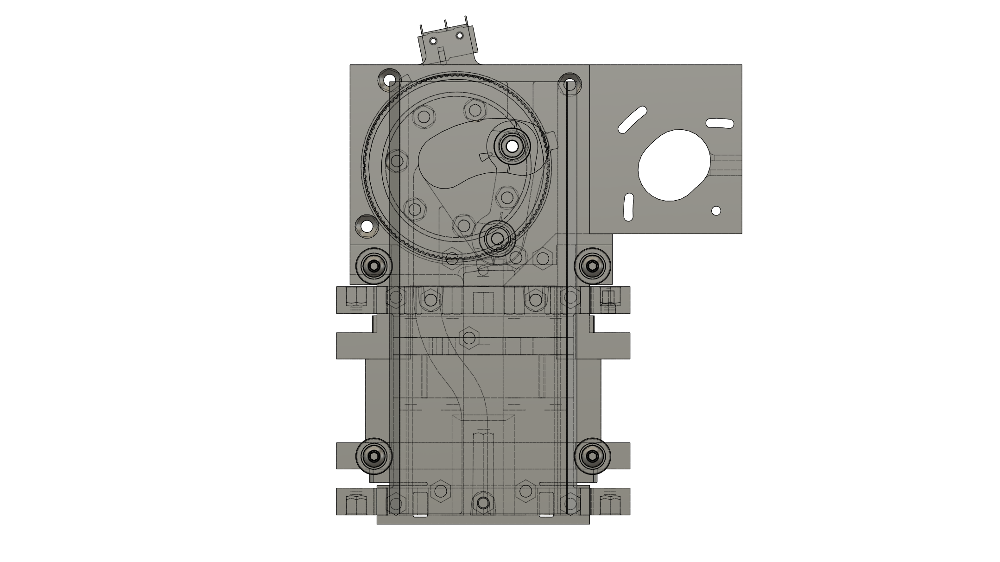

There's still some handfuls to do here, namely that the z drive motor needs to get out of the way... I think this is a bit of a pain: I need to stretch it much farther away from center in either case (left or right) and going right requires some likely re-manouvering of the drive gear / etc... since that has been biased to one side.

I think going right, also, is like necessary: otherwise the motor is going to interefere when we drop / pickup tools at the angle.

I suppose there is also a version where I mount the motor _behind_ w/ some kind of flipped plate... actually on second glance this actually looks like the move, I think I'll do it.

Should have done that earlier actually, it's a decent rework.

I'm stashing CAD here of this version, since it's a just-about complete roll of an idea I didn't end up implementing:

[cad for cam-actuated xz](../cad/2021-10-31_clank-stretch-xz-v6.f3z)

## 2021 11 02

OK we are flipping the motor. I think I am maybe also (?) going to up the reduction size to squish the motor a little tighter in.

Damn I can crank the ratio way up here... I guess it's worth it, some of these tools might be heavy AF.

This is working alright, I just have presented myself with a limit switch problem.

Oof, I've made myself X and Z limit switch problems actually.

Big oof, I've actually totally goofed this.

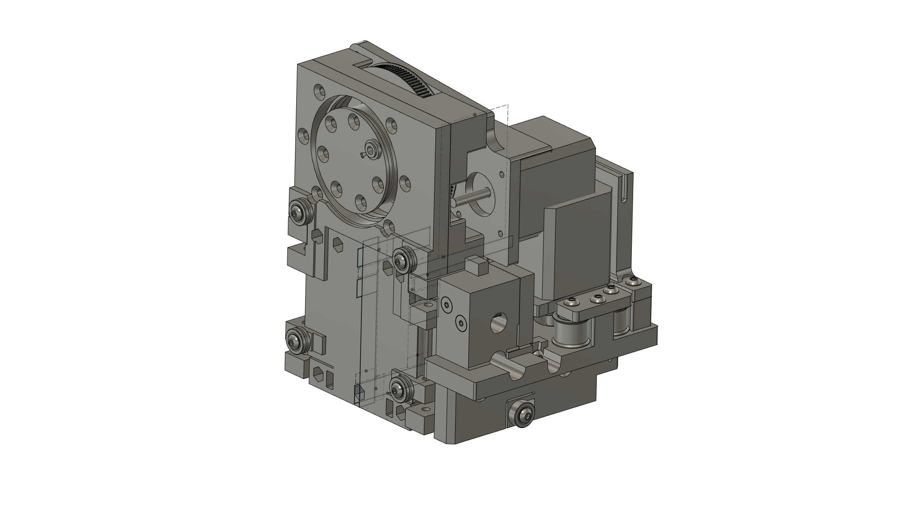

Of course this was why I had the thing flipped around. Damn, I was stoked about the revision. Guess I'm back to the board.

Sheesh - I am also remembering that the 30-pin for the hotplate is here on the left... so sticking a motor out beside is is not going to be the coolest. I think it'll have to do though.

Sorted it out _again_

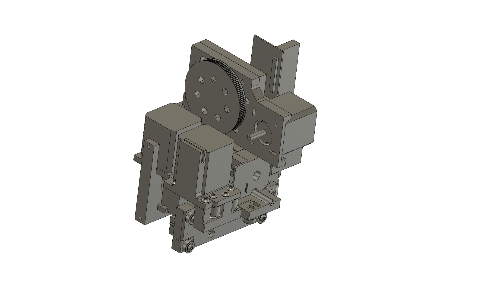

Calling it here, that was a fine runaround.

## 2021 11 10

Yeah - getting back to a simple belt drive w/ this one, sheesh. Going to see if I can squeeze in a small reduction, as a treat.

So I had never thought that it would be reasonable to fit a leadscrew in here, but I was perhaps wrong:

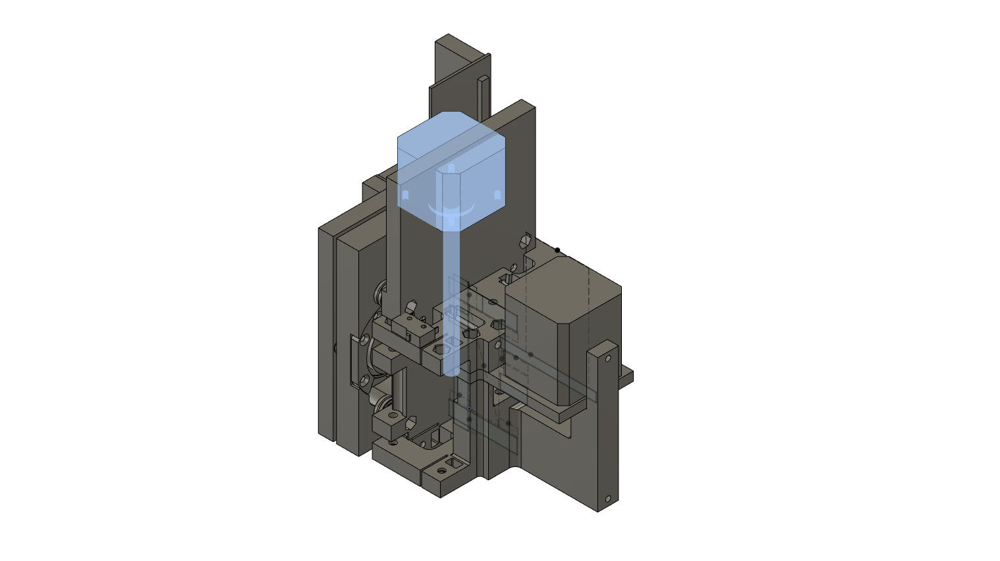

This... is probably the most performant move. I need to model / check how big the z-nut is. It's like, would fit _barely_ so I would likely be adding ~ 5mm gap to get it to stick, and I would be modifying the layout of the hotplate a little, to make room for the nut / etc.

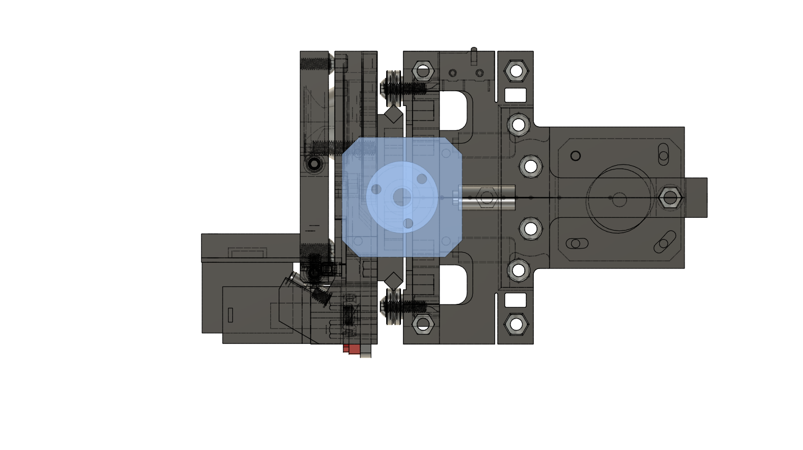

I should check also the belt drive solution.

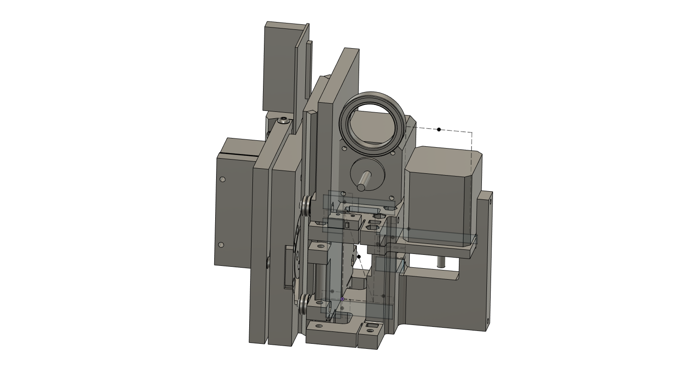

This I can tuck in here pretty nicely as well... I think that since it's keeping in spirit w/ the project, keeps the BOM tiny and the motors identical, etc, I'll use this layout, or at least try it on. I think I can also tuck the z offset in with this as well, maybe by ~ 4mm or so.

Alright let's check it out: I have 16 pinion teeth pulling on 80 for a 5:1 reduction there, final drive is then 28 teeth. The dead easy version is just whacking the 16t directly into the belt, here I am basically adding the leverage between 80:28 teeth, so just under 3x bonus leverage. It might be wise then to do a ~ 20T final drive, to get that 4:1.

In either case I think a 3x or 4x increase _is_ worth the small complexity of this second reduction.

So I've designed some of these patterns before haha...

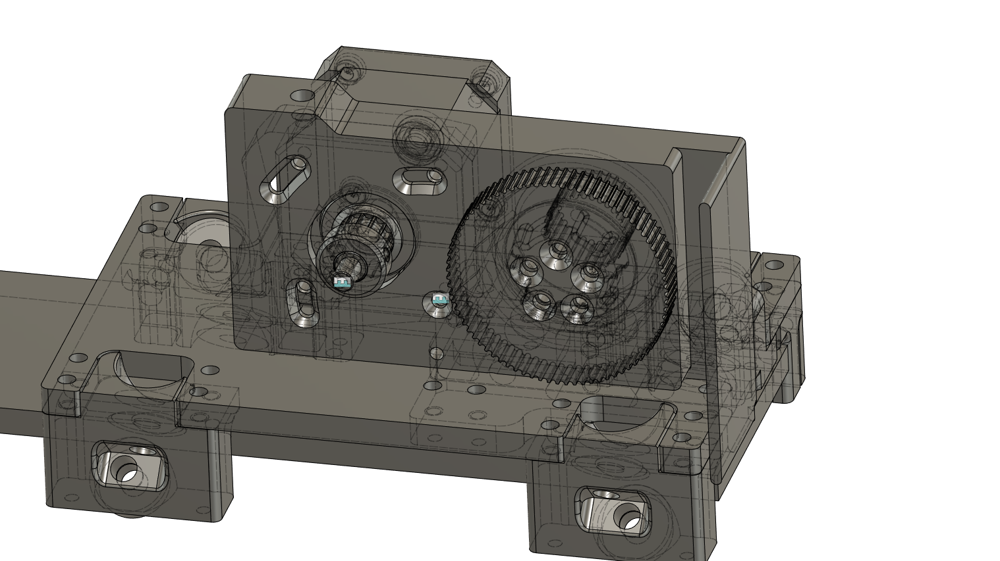

More or less the same energy here!

Squishing this motor in here is tough work, there's not _really_ enough room to make it fit.

I think maybe I should be considering lifting the top z-rollers up, out of this mess. I don't like how much plastic that puts in the way, all bendy as it is, but it might be the only way to fit the motor in here.

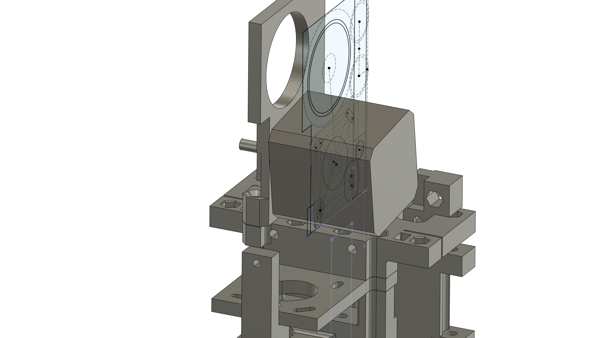

I don't even know what the "final" roller situation is anyways.

And this motor fitment: it's only a problem if I want the rotary tension: I can just put some dummy slots in here to slide the motor directly vertical. Setting that up kind of clears the whole situation.

## 2021 11 11

Working it out... need some z-belt now, and endstop.

Alright: have a limit. I think this is done, save that little x limit detail... done.

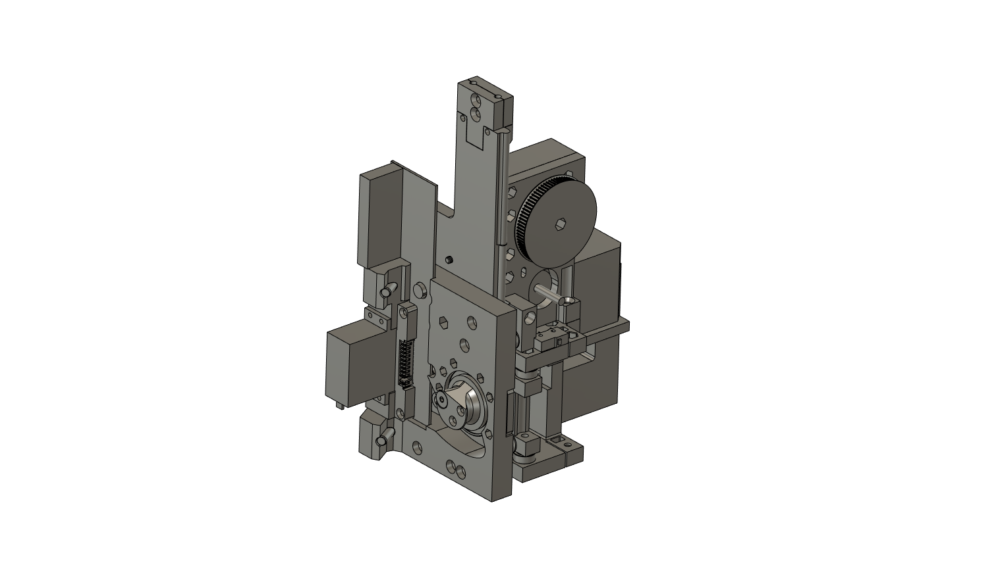

## 2021 11 12

Mostly done now here, so next / last is doing the chassis CAD, end-nubbins / chassis framing (?) and check thru my list below and see about documentation stubs.

Curious about that change though, here's the old CAM version & the new belt:

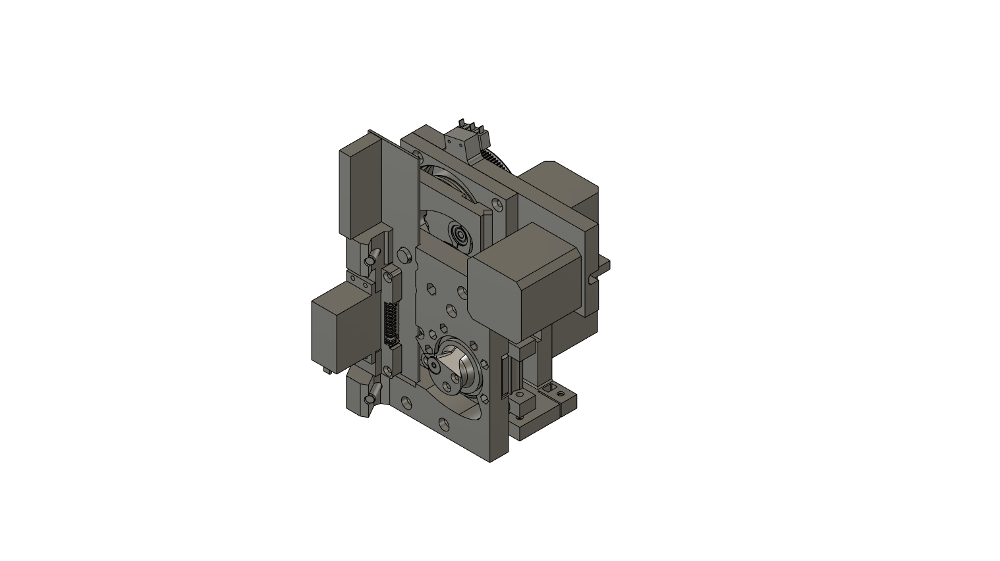
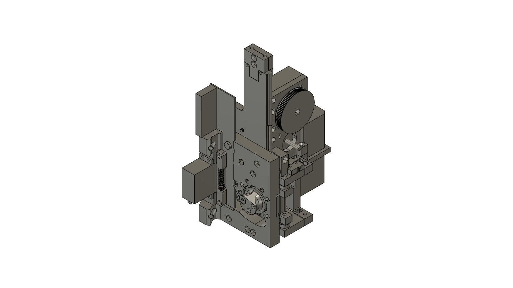

Offsets:

TCP is center of _back_ edge on toolpate.

| TCP to Right Edge of X Carriage | 40.8 |
| TCP to Left Edge of X Carriage | 62.7 |
| YL Rail Edge to Flat | 13 |
| YR Rail Edge to Flat | 14 |
| YL / YR Beam Insert | 3 |
| X Rail Edge to YL / YR Front Face | 17 |
| X Rail Edge to YL / YR Rear Face | 80 |
| X Rail Edge to TCP | 38.65 |

OK I'm here:

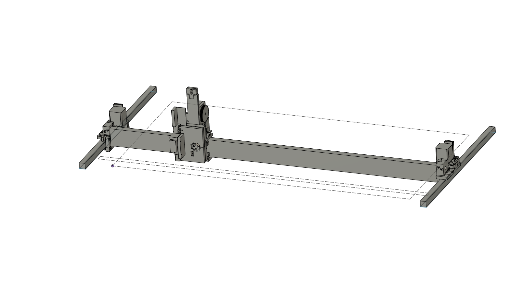

I'll need z throw (22mm) and the `rail bottom edge to clearance` value (13.5) for a total 35.5mm of rail-to-board, nice tiny floater.

This printed part is _for sure_ going to be the trickiest. And I'm not sure about how to actually separate these systems: do I print something straight onto the bed? Seems unlikely to be really decent / performative. Maybe a proper extrusion chassis.

I have considered things like this:

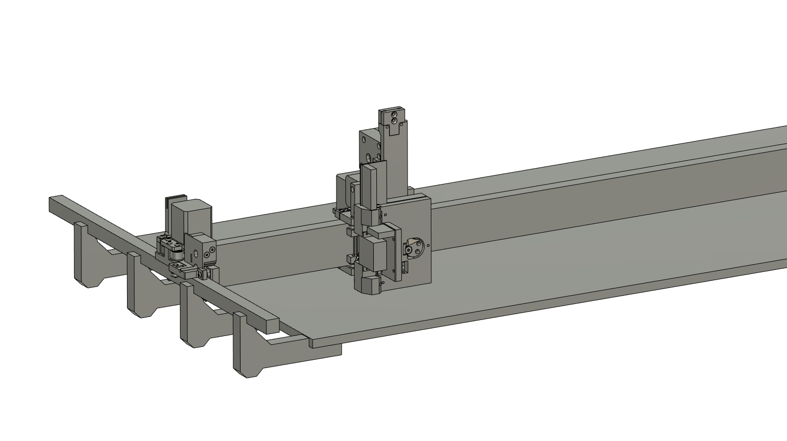

But it feels floppy, and is kind of asking for a lot of printing.

I should mention that one goal is that we can cut i.e. a 24x36" sheet if we use a 24x36" sheet as the bed stock: hence all the overhang.

I am looking at the [lasersaur](https://github.com/nortd/lasersaur/wiki) for [chassis inspo](https://www.flickr.com/photos/cwwang/sets/72157630319998790/)... lots of very heavy extrusion in there.

Probably the _right_ way to do this is to use a 20x60 YL / YR rail here, modifying YL / YR again and then we get all kinds of hookup on the sides for frames & i.e. cable routing.

It's clean, for sure. I think it's probably a ... not monstrous amount of CAD, and then I won't be doing this again.

On the other hand - I already have the other size frame set up, and there's a level of simplicity to it that's probably worth holding on to. I suspect -stretch will not actually become a 4x8' machine: and anyways around that size the structural scaling is kind of the key issue. This approach should stay kind of radically simple and cheap / etc.

Here's that frame again:


These are wicked simple, love it. Adding a little bit of stiffening, then hollowing out somewhat to print quickly...

OK, then some frame struts in the model, choosing a size for the rear offset, a size for the front / toolchanger offset, and we are into cable routing...

That's it for mechanical then, I need cable routing.

I'll send a 30-pin along the left edge, then out to the x carriage... and I also want one 10-pin to YL / YR.

I might actually just try the same thing as I do in -fxy, with a big pin in the back, and flying lines out to all three. I totally expect I'll need to reinforce those lines a little, but I can mess around with that in situ.

Then I think the only things I need to add are (1) a rear / frame mount for the 30-and-10s circuit, then caps on the YL / YR cable grips. Or maybe just thru holes for zip ties.

OK, this might be it then?

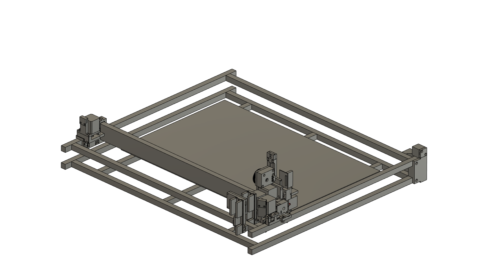

Seems maybe a little too easy, but the exercise here is for a simple one. So I should pick a size and then spec a BOM... send a round of prints, then go do something else.

Sizes: Alfonso suggests A1 at ~ 850.5 x 600 (actual 841x594) or A2 at 600.5 x 430 (594x420).

The A1 is _large_ - I think I'll stick w/ a tiny version for now, for the wellbeing of everyone involved: and for the desk space... and I am planning on traveling with this thing, shouldn't forget.

The travel case I will eventually schlep this thing in has a long side of ~ 990mm, so there's a limit there.

| Size Spec | X Travel, mm (inch) | Y Travel   | X-trusion Len | Y-trusion Len |
| --------- | ------------------- | ---------- | ------------- | ------------- |
| A1        | 850.5 (33.4)        | 610 (24.0) | 981           | 934           |
| A2        | 620.5 (24.4)        | 420 (16.5) | 751           | 744           |

While I am stoked about the larger format, I think for dev purposes (and travel) staying smaller is sensible... likewise w/r/t supporting cable traversals.

It may be the case that this performs wonderfully, in which case looking at a big version would be cool. More likely a really large "zund contender" would be phenolic, real belts, milled aluminum parts, etc. We stay in toy land for now.

So! The doc assembly now, I'll do a BOM spreadsheet... and CAD models, I suppose.

Hot dang... this takes time: my guess for the whole machine is ~ 2 more hours, maybe more. It is causing me to check a lot of stuff (caught one error already that would have been ~ 2 hours of assembly), and it is improving the CAD speed as well to get rid of these threads. And... building the BOM at the same time. But it's pretty mind numbing.

## 2021 11 13

Wouldn't mind finishing the hardware outfit today - "just" have YL and YR to do now.

## 2021 11 14

Didn't get much into it yesterday - party prep - but back at it... nearly done.

Alright the model for -stretch is done, so I can write up the BOM, then I'd be ready to do the ordering for machine week.

## 2021 11 15

I've a BOM here now, just trying to figure if I can anneal the hardware list to have a smaller unique set. Definitely sore for a better way to manage this stuff.

## 2021 12 03

Putting this together lately,

- cable routing nubs need the loose DOF to be loose (taper)
  - maybe ... something entirely different, for the clipping ? fk it, screws ?
- cable routing should have 'tip' printed bits, that allow to mount w/o the 'last' one underneath, i.e. where in -stretch the cable mounts to the motor at yr, x
- or sort this floating end out, yr needs to shoot it back at 90' I think, and anyways yr will mirror yl now right ?
- cable ribbons should have 45' edge so that if they do catch on things they sweep over, rather than catching...

## 2021 12 08

Made some progress... here's toolchanging


## 2021 12 10

I am actually quite pleased with this design, and I think it really sings in the 'stretch' scale, where the 'fxy' design feels awkward... and should perhaps be corexy / etc.

I have a bunch of deltas that I want to make now that I've one of these up and running, to turn it into a really mad decent thing - in particular I think it's just a few small tweaks away from being a machine we could realistically make close-to-4x8' machines with, though I wouldn't really recommend it, at least it could be possible to scale this much.

Yeah 4060 is the move, it's 1.8kg/m, where 2060 is 1.26kg/m, this is an OK increase, but the 20x80 is a whole 2.7kg/m, more than double. I just need it to be a box, at all, rather than a plane. 

I think that opens great new ops for belt tensioning as well, so I'll have to poke around and see... 

So where to start then? Probably at X, working back... I'm thinking a little bit about going from M4x14 BHCS as a base -> M4x16 BHCS, adding that extra mm of thickness to plates all around... 

Actually the "move" might be to drop the z-rollers on shoulder bolts... 

- embiggening for 4060 
- enthickening faceplate for more z stiffness... 

Kinda stoked about this, no bones about it. Proper cable chain situation, low slung fast machine? FT. 

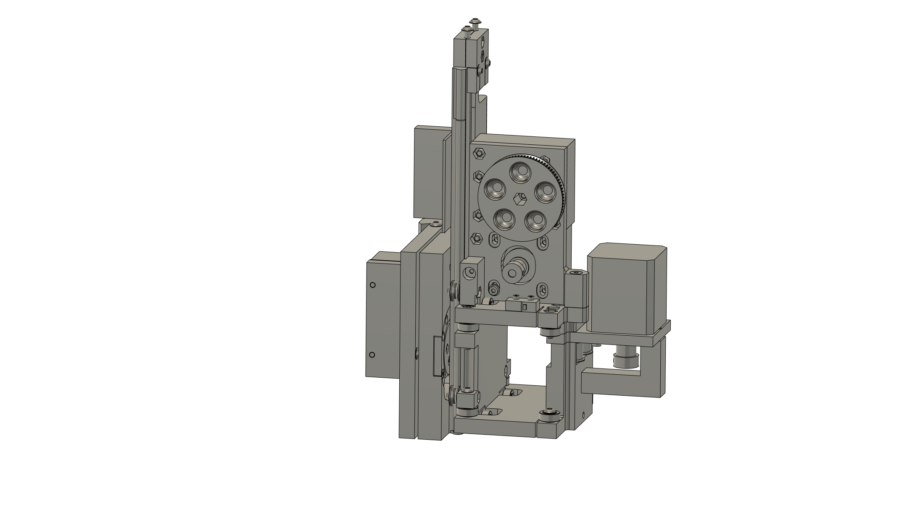

There's the girthy XZ, looks totally torsional, nice. If I can improve the belt mounting / tensioning on a new YL, I will indeed be able to delete the rotary x motor thing. 

Also, have I ever mentioned, that I detest this YL assembly? It might be that now is the time to unf- this thing. I think if I take for granted that I *will* tension belts differently in Y, where the space for sure exists to do so, I can simplify a great deal. 

These assemblies also make *a lot* more sense in side profile, but I do this awkward thing at the moment... 

I'm squanching a bunch of stuff here, and I am reminded that there was a notion to push the YL/YR motors *forward* of the x axis, since anyways there is all kinds of deadspace here for toolchanging. I think it's compelling, perhaps especially because I can float the X motor over the rear chassis element... however, I pickle myself with cable routing here again, 

Yeah this is not a good idea, the motors need to tuck together in the back to decrease X offsets. 

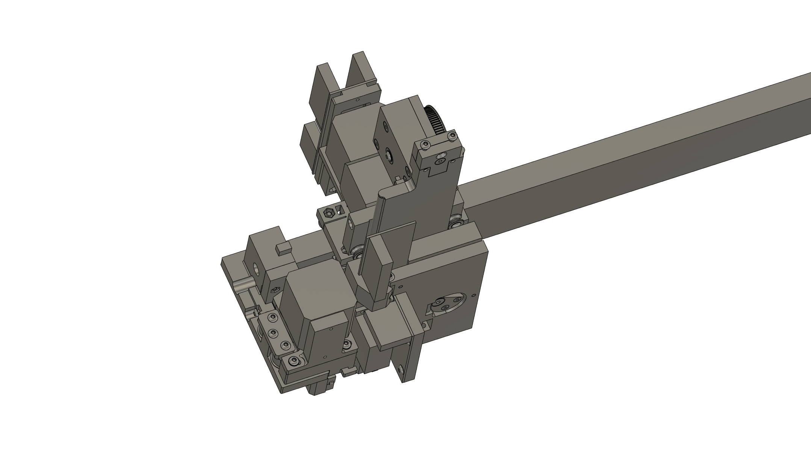

OK! I am deleting the x motor plate and integrating it with the x top plate, that should make the thing a little stiffer and, for real, easier to assemble. Now I am into the YL pretty well, having most things worked out OK... 

haha woooof can't do that, belt and rear x bearings overlap! easy enough to undo... still pinching it up though 

next I want to clean the x up... still stiffer motor plate, then figure where to pin the 30cond 

Yep, and the tray is going to be kind of a pain... really it should tack onto the rail, but we are doing this complete wrap around it. 

there's also a more bonkers version where the ribbon does go up against the rail, then we wrap the rest of the x carriage around it... it's kind of obscene, but might be "the move" - idk 

## 2021 12 11 

Tidying the x, then running cable routes... 

Biggest issue now really is the cable tray itself. 

It's a long run across, 730mm. The temptation is to just string a series of printed channels down, that'd be actually just three prints at 250mm across each, but kind of painful as well. It is kind of bonkers though, and I think a 700mm run of printed beam is going to sag. 

I would bet that aluminum tube is the right answer... tubing of whatever kind is something we should be able to assume is available around the world, and with the right size we can tap & fix the tips to our carriages... I could of course also just do this with more 20x20 extrusion, then have the same actual cable-guide part for X and Y gantries. 

That adds about 500g *more* mass, again... which leads to the old tuck-it-behind-the-x-rail question. 

I suspect that *is* it, but oh my it's some kind of rework. It's a bit of a transfer beam in the podium-tower, isn't it... but if it saves 500g with ~ 150g, that's a win. 

The second-extrusion has the bonus effect though of squaring up those endplates... 

I am trying this out, but it *looks* loose and floppy;

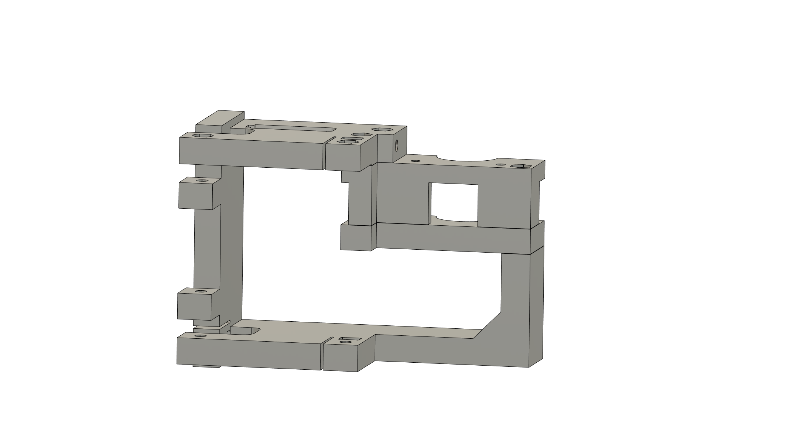

So I think I am going to go the other way, and stick an extrusion in for the cable guide support. 

This is also dead easy:

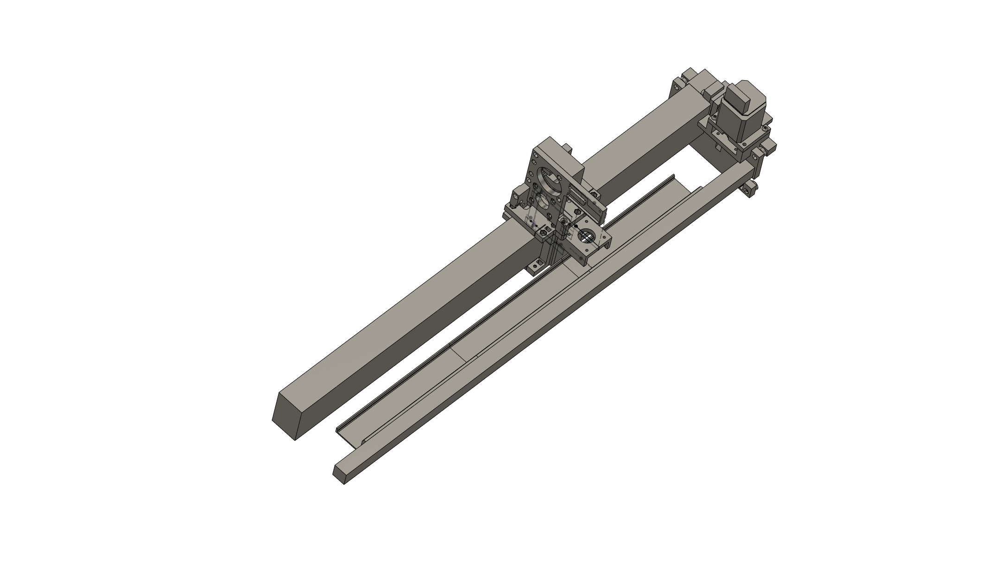

I'll at least be very motivated to turn the closed loop motors up to 11. 

Only thing now is cable tendies around the YL situation... and chassis corner tidying. 

## 2021 12 12 

Nearly done here & ready to setup prints... just tidying a few things, designing the Y and X cable tensioners (X just needed an improvement)... 

OK, going to put this out to fab. I've to wonder if I should be building from scratch & leave the other machine together for these UROPs, or should do the ship of theseus style...

- upd8 cad, push the log, post new image 

## 2022 01 03 

Assembling the giga- today, so notes here.

## 2021 01 06 

Back at this... and damn, I may have tossed the corner piece prints (?) the old ones are on the desk, new ones no where in sight... so, dang, lol, I guess I am into the CAD again this afternoon. 

So I'm doing some tiny deltas, but the real question is about setting up complete models, w/ hardware etc... 

## 2021 01 08

It continues. I'm officially up against the missing basement hardware kit, which anyways won't arrive until Monday. I could totally get the cable routing stuff up though. 

... did the hotplate mounting update, now printing... so, assembly is done until hardware is here, and I have notes on what kit I need to bring into lab. 

and, tape chains, nice: 


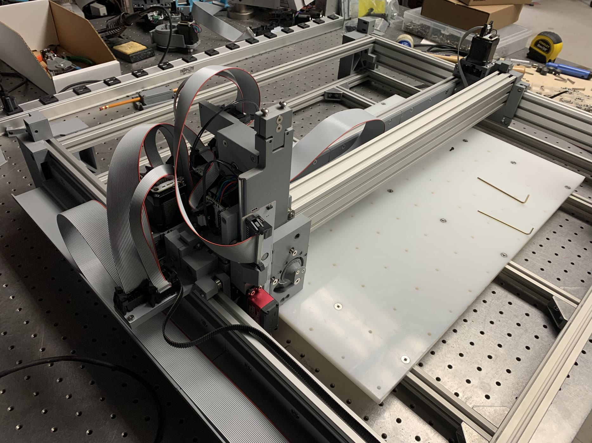
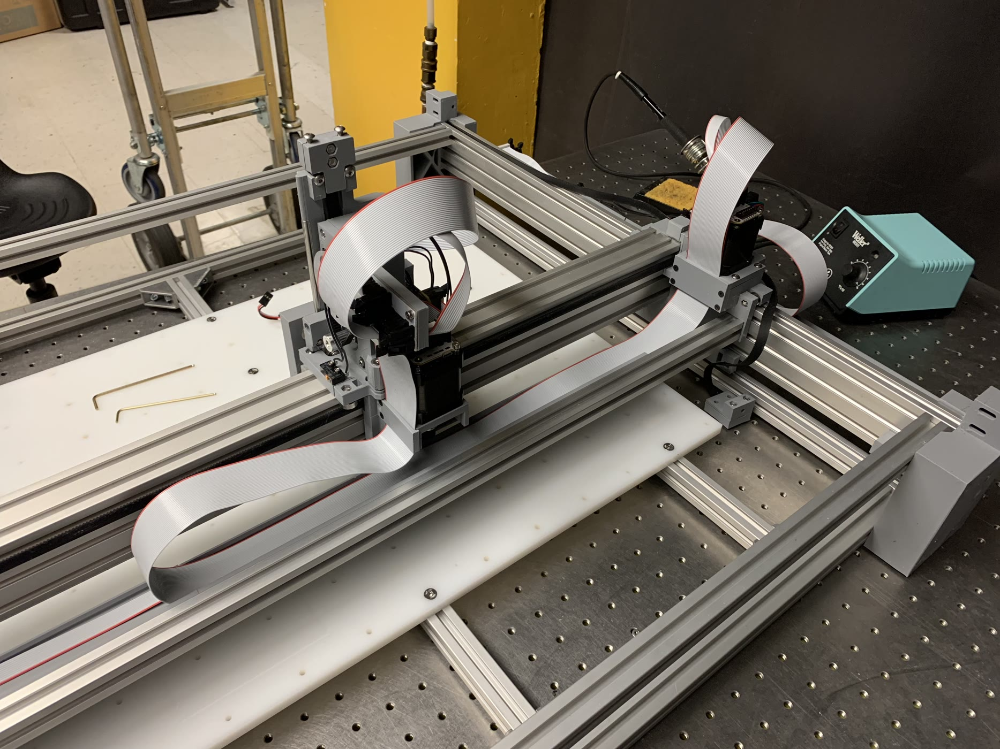

## 2022 01 26 

Alright I'm trying to tie off the ends on this thing today... mostly I guess that's making the cad hardware complete, then trying to work up a BOM. 

Trickiest bit, for sure, is working up the BOM. 

## 2022 01 27 

I'll be done w/ this today. I'm going to start w/ a full CAD walkthrough, making sure all of the hardware is in place. Then I'll figure out how to automate some BOM runup tools, and maybe do a CAD purge, the current fusion workspace is pretty crufty. 

I should probably run this through like one sub assembly first anyways... the BOM tools, then see to what extent I want to flesh out models. 

It seems like an actually likely solution is to use the drawings tool here.

Ah, it's kind of aweful. I think there's no easy way through this, I'll just have to publish CAD and some top level BOM. 

Oof, IDK. Looking at Bommer and OpenBOM. Bommer... maybe is it, it's $100/yr. I can try it for 14 days, I think that's worth the experiment. 

Bommer seems like it. I suppose the rest of the pipeline is via google sheets? I would sort of prefer to have local sheets though. They'll each need a little sorting... and I suppose the goal is to publish them, so google sheets? I'll figure that later. 

This is a big sort out then... I want to sweep through and flesh out parts, make sure materials are applied, then organize boms for make / buy etc. I also have the meta question of how to sort my own CAD folder. 

I'll run through as much detail as I think I need for the hotplate & interposer, then see about generating a build section for them. 

Yeah, a demo for the hotplate... I guess I'll build ruby / jekyll on this pc as well. 

The gd BOM tools don't list a part's bodies by default, that's a bummer. I'll have to do enough editing then. Which means I don't really accomplish my goal of automated pipelining. 

OK well BOMMER does transfer part properties on an export-import cycle, so that's tite... I can populate things with vendors etc and at least that part of the BOM will be automated. 

Like ECAD, this is the kind of thing where some upfront work in description / model completion can be a great help. 

Done w/ the XZ assembly, surely that's about half of the machine. I mean, look at this monster:

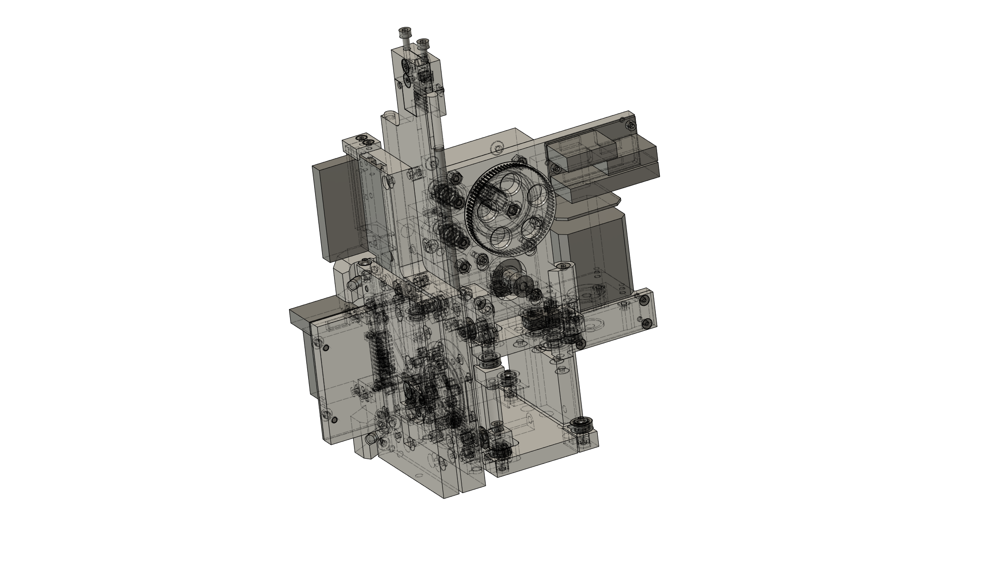

Just the YL, YR, corners and bed left... nearly BOM ready. 

Just the frame now... 

This is way too heavy, I am going to setup a situation where the basics are in place, and one group is left at the tail of the thing, supressed. Last two groups. Doesn't really help though, top level assy is still monstrously slow. 

Sweet lorde, it's like all day, but it's done now. Certainly haven't found any secret for hardware publishing... I'm rebooting fusion and I'll try a test BOM, then populate hardware / etc? Finish writing the site, push repos & bedone with it? 

## 2022 02 07 

### Toolchanger Perf 

I had a chance to performance test this yesterday, hotplate included. I'm going to note-take from video streams here, then post results on the webby. Here's the raw stuff:

| hotplate touchoff | x data | x deviations, mm (inch) | y data | y deviations, mm (inch) | z data | z deviations, mm (inch) |
| --- | --- | --- | --- | --- | --- | --- | 
| 1 | 5.501 | -0.0172 (-0.0007) | 3.750 | -0.0063 (-0.0002) | 4.528 | 0.0088 (0.0003) |
| 2 | 5.496 | -0.0122 (-0.0005) | 3.744 | -0.0003 (-0.0000) | 4.535 | 0.0018 (0.0001) |
| 3 | 5.481 | 0.0028 (0.0001) | 3.743 | 0.0007 (0.0000) | 4.539 | -0.0022 (-0.0001) |
| 4 | 5.475 | 0.0088 (0.0003) | 3.742 | 0.0017 (0.0001) | 4.539 | -0.0022 (-0.0001) |
| 5 | 5.474 | 0.0098 (0.0004) | 3.742 | 0.0017 (0.0001) | 4.540 | -0.0032 (-0.0001) |
| 6 | 5.476 | 0.0078 (0.0003) | 3.741 | 0.0027 (0.0001) | 4.540 | -0.0032 (-0.0001) |

Then something a little easier to read:

| axis | standard deviation after pickup, mm (inch) | average from center, mm (inch) |
| --- | --- | --- |
| x | 0.0047 (0.0002) | 5.921e-16 (2.331e-17) |
| y | 0.0033 (0.0001) | -2.220e-16 (-8.742e-18) |
| z | 0.0047 (0.0002) | -1.480e-16 (-5.828e-18) |

These are all astoundingly good. Kinematics coming in hot. Standard deviation tells us how far off of zero the thing will be after each pickup, then average deviation could tell us if it's relatively well centered. Here's how I calculated that:

```python
def avgdev(series):
    center = avg(series)
    sum = 0
    for i in range(len(series)):
        sum += center - series[i]
    avgd = sum / len(series)
    print(avgd)
```

So, we can expect about 5 microns of error after each toolchange. That these errors are well centered (across only 6 samples anyways) is not terribly exciting / relevant.

### Motion System Perf 

Next I just hysteresis-checked the thing... I should include the video here, and maybe make some plots on each axis. 

Alright this test is surprisingly revealing, and I'm also seeing some alarming drift in the z axis. 

I just want to write a quick way to display all of this data... I think I'm just going to plot things out and then discuss / pick round numbers from the plots. 

Alright I'm just collecting plots for these;

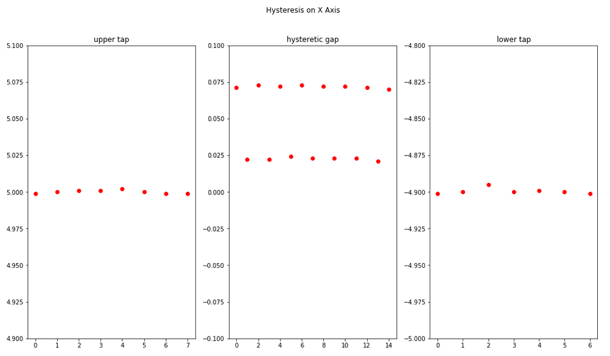
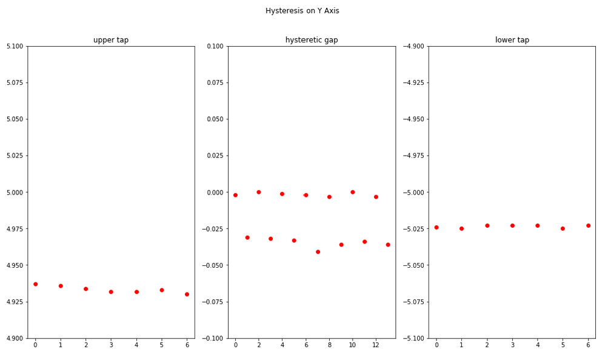
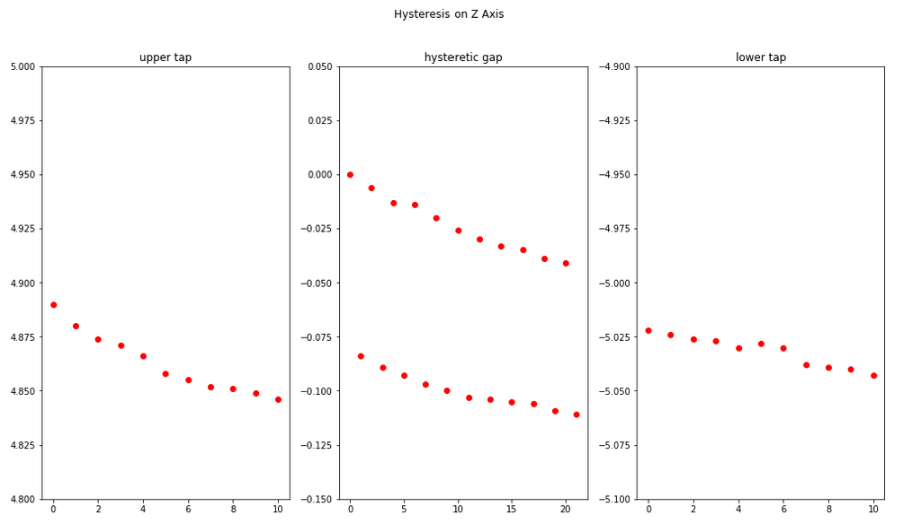

These all look ~ similar enough, though Z is notably worse. Here's what I reckon:

| axis | hysteresis mm (inch) |
| --- | --- |
| x | 0.050 (0.0020) |
| y | 0.035 (0.0014) | 
| z | 0.075 (0.0030) | 

These are a lot worse than the repeatability tests, which registered about one whole order of magnitude less error, including the toolchanger swapping. I will write these up on the site and look forward to hooking the controllers up to closed loop, seeing if any of this can be reclaimed. 

